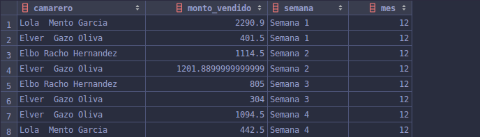

Fernando Josué Flores Valdez, 20150438

Sistemas de Bases de Datos 1

Vacaciones Diciembre 2019

------

## HT 3

# Querys

## Query 1

```mysql
# QUERY 1
select distinct
  m.idMesa 'Mesa',
  count(df.Plato) 'Platillos'
from
    DetalleFactura df
        join Factura f on df.IdFactura = f.idFactura
        join Mesa m on f.idMesa = m.idMesa
group by m.idMesa
order by Platillos desc
limit 10
```

### Result


------

## Query 2

```mysql
# QUERY 2
select *
from (
         select Cliente, count(Cliente) 'veces_que_gasto'
         from (
                  select Cliente
                  from (
                           select concat(c.Nombre, ' ', c.Apellido1, ' ', c.Apellido2) 'Cliente',
                                  sum(df.Importe)                                      'Total'
                           from DetalleFactura df
                                    join Factura f on df.IdFactura = f.idFactura
                                    join Cliente c on f.idCliente = c.IdCliente
                           group by f.idFactura, concat(c.Nombre, ' ', c.Apellido1, ' ', c.Apellido2)
                       ) totales
                  where Total > 200
              ) clientes
         group by Cliente
     ) gastos
where veces_que_gasto > 1
```

### Result


------

## Query 3

```mysql
# QUERY 3
select
    concat(c.Nombre, ' ', c.Apellido1, ' ', c.Apellido2) 'camarero',
    sum(df.Importe) 'monto_vendido',
    case
        when (DAY(f.FechaFactura) >= 1 and DAY(f.FechaFactura) <= 7) then 'Semana 1'
        when (DAY(f.FechaFactura) >= 8 and DAY(f.FechaFactura) <= 15) then 'Semana 2'
        when (DAY(f.FechaFactura) >= 16 and DAY(f.FechaFactura) <= 23) then 'Semana 3'
        when (DAY(f.FechaFactura) >= 24 and DAY(f.FechaFactura) <= 31) then 'Semana 4'
    end 'semana',
    MONTH(f.FechaFactura) 'mes'
from DetalleFactura df
        join Factura f on df.IdFactura = f.idFactura
        join Camarero c on f.idCamarero = c.IdCamarero
where MONTH(f.FechaFactura) = MONTH(DATE(NOW()))
group by camarero, Semana, mes
order by Semana
```

### Result



------

## Query 4

```mysql
# QUERY 4
select
       concat(c.Nombre, ' ', c.Apellido1, ' ', c.Apellido2) 'camarero',
       (100 * count(f.idFactura)) / total 'percntage_facturas',
       f2.total 'total_global'
from
     Factura f
         join Camarero c on f.idCamarero = c.IdCamarero
		 join (select count(idFactura) total from Factura) f2
group by Camarero, total_global;
```

### Result

