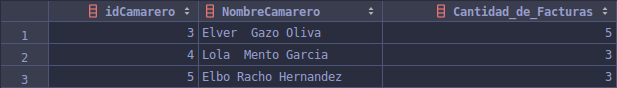
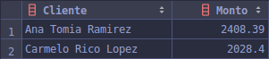

Fernando Josué Flores Valdez, 20150438

Sistemas de Bases de Datos 1

Vacaciones Diciembre 2019

------

## HT 2

# Querys

## Query 1

```mysql
# QUERY 1
select distinct
  m.idMesa 'Mesa',
  count(df.Plato) 'Platillos'
from
    DetalleFactura df
        join Factura f on df.IdFactura = f.idFactura
        join Mesa m on f.idMesa = m.idMesa
group by m.idMesa
order by Platillos desc
limit 10
```

### Result


------

## Query 2

```mysql
# QUERY 2
select
    c.IdCamarero 'idCamarero',
    concat(c.Nombre, ' ', c.Apellido1, ' ', c.Apellido2) 'NombreCamarero',
    count(f.idFactura) 'Cantidad_de_Facturas'
from
     Factura f
        join Camarero c on f.idCamarero = c.IdCamarero
group by c.IdCamarero;
```

### Result



------

## Query 3

```mysql
# QUERY 3
select Cliente, Monto from (
select
    c.IdCliente,
    concat(c.Nombre, ' ', c.Apellido1, ' ', c.Apellido2) 'Cliente',
    sum(df.Importe) 'Monto'
from
     Factura f
        join DetalleFactura df on f.idFactura = df.IdFactura
        join Cliente c on f.idCliente = c.IdCliente
group by f.idCliente) montos
where Monto > 2000
group by IdCliente
```

### Result



------

